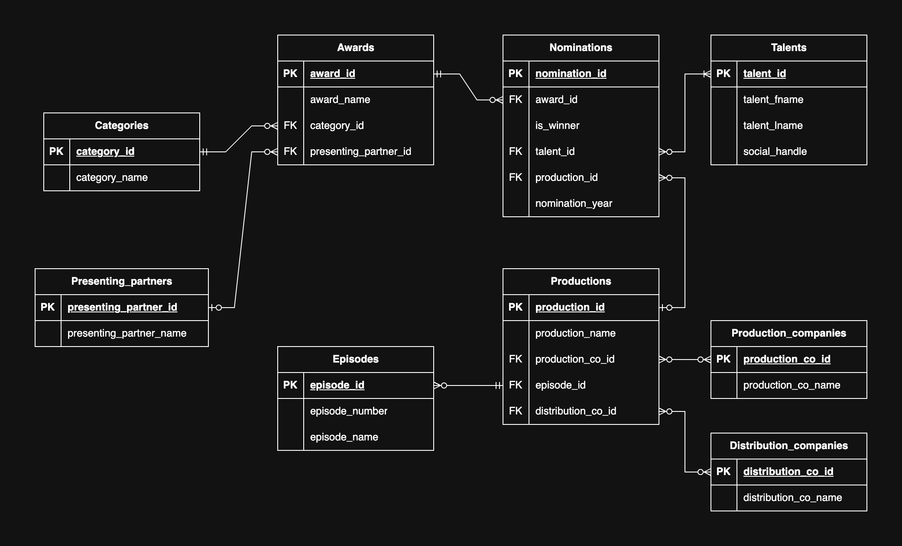

# Awards SQL scripts

## Background:

- An award belongs to one and only one category.
- An award has zero or many nominations.
- A winner will be decided only upon nominees.
- Each nomination is designated to one and only one talent which is associated with zero or one production.
- A talent can be nominated for one or many awards.
- An award has zero or one presenting partner.
- A presenting partner can present zero or many awards.
- A talent can receive nominations zero or many times.
- A production can be part of the nomination zero or many times.
- A production has zero or many stakeholders, including production companies and distributors.
- For certain TV technical craft awards, a nomination refers to a specific episode.

## Reference:
- https://www.aacta.org/aacta-awards/winners-and-nominees/
- Based on Television, Film, Short Film, Documentary and Online 

## ERD:

