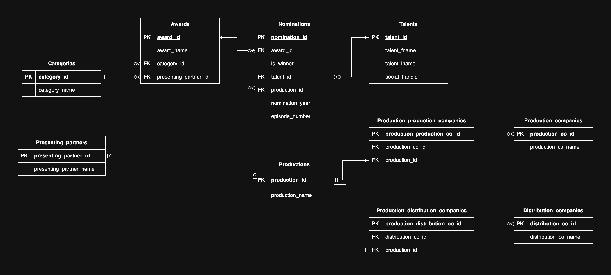

# Awards SQL scripts

## Background:

- An award belongs to one and only one category.
- A category has zero or many awards.
- An award has zero or many nominations.
- A winner must be decided upon nominees.
- An award has zero or one presenting partner.
- A presenting partner can present zero or many awards.
- A nominee or a winner can be either a talent or a production.
- When a talent is nominated, there will be zero or one production associated.
- When a production is nominated, there will be zero or many talents associated. 
- A talent can be nominated zero or many times for the same award (in different productions).
- A production can be nominted zero or many times for the same award (with different episodes in technical craft awards).
- A production is created by zero or many production companies.
- A production is distributed by zero or many distribution companies. (Distribution companies only apply to TV awards.)
- A talent can be nominated for one or many awards.
- A production can be nominated for one or many awards.
- For certain TV technical craft awards, a nomination refers to a specific episode.
- An episode has zero or one episode name.

## Reference:
- https://www.aacta.org/aacta-awards/winners-and-nominees/
- Based on Television, Film, Short Film, Documentary and Online 

## ERD:

